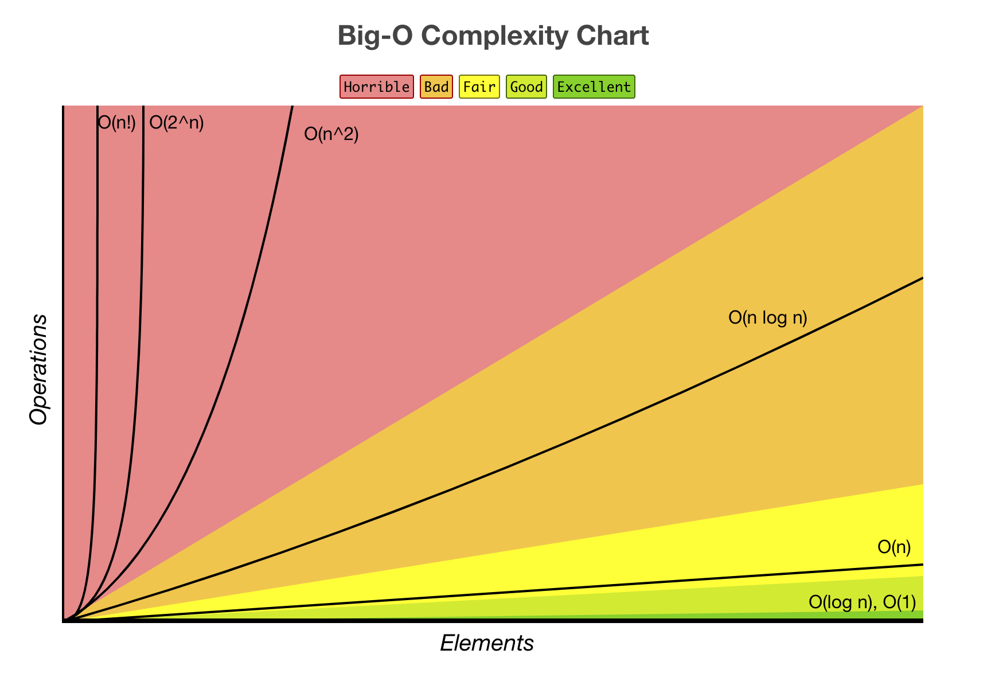
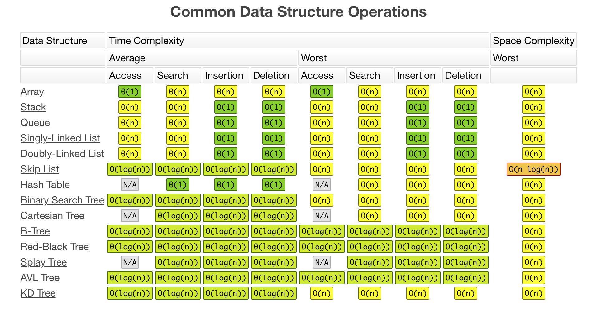
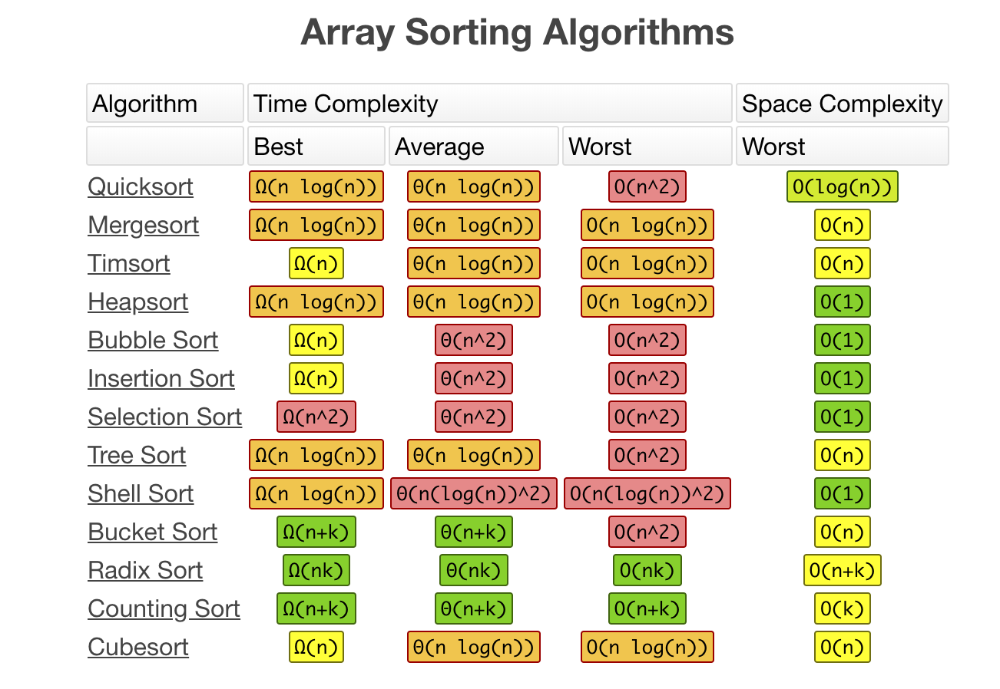

# CodeTrain

## Data Structures

A data structure is a particular way of organizing and storing data in a computer so that it can
be accessed and modified efficiently. More precisely, a data structure is a collection of data
values, the relationships among them, and the functions or operations that can be applied to
the data.

`B` - Beginner, `A` - Advanced

* `B` [Linked List](./data-structures/linked-list)
* `B` [Doubly Linked List](./data-structures/doubly-linked-list)
* `B` [Queue](./data-structures/queue)
* `B` [Stack](./data-structures/stack)
* `B` [Hash Table](./data-structures/hash-table)
* `B` [Heap](./data-structures/heap) - max and min heap versions
* `B` [Priority Queue](./data-structures/priority-queue)
* `A` [Trie](./data-structures/trie)
* `A` [Tree](./data-structures/tree)
  * `A` [Binary Search Tree](./data-structures/tree/binary-search-tree)
  * `A` [AVL Tree](./data-structures/tree/avl-tree)
  * `A` [Red-Black Tree](./data-structures/tree/red-black-tree)
  * `A` [Segment Tree](./data-structures/tree/segment-tree) - with min/max/sum range queries examples
  * `A` [Fenwick Tree](./data-structures/tree/fenwick-tree) (Binary Indexed Tree)
* `A` [Graph](.data-structures/graph) (both directed and undirected)
* `A` [Disjoint Set](./data-structures/disjoint-set)
* `A` [Bloom Filter](./data-structures/bloom-filter)

## Algorithms

An algorithm is an unambiguous specification of how to solve a class of problems. It is
a set of rules that precisely define a sequence of operations.

`B` - Beginner, `A` - Advanced

### Algorithms by Topic

* **Math**
  * `B` [Bit Manipulation](./algorithms/math/bits) - set/get/update/clear bits, multiplication/division by two, make negative etc.
  * `B` [Factorial](./algorithms/math/factorial)
  * `B` [Fibonacci Number](./algorithms/math/fibonacci) - classic and closed-form versions
  * `B` [Primality Test](./algorithms/math/primality-test) (trial division method)
  * `B` [Euclidean Algorithm](./algorithms/math/euclidean-algorithm) - calculate the Greatest Common Divisor (GCD)
  * `B` [Least Common Multiple](./algorithms/math/least-common-multiple) (LCM)
  * `B` [Sieve of Eratosthenes](./algorithms/math/sieve-of-eratosthenes) - finding all prime numbers up to any given limit
  * `B` [Is Power of Two](./algorithms/math/is-power-of-two) - check if the number is power of two (naive and bitwise algorithms)
  * `B` [Pascal's Triangle](./algorithms/math/pascal-triangle)
  * `B` [Complex Number](./algorithms/math/complex-number) - complex numbers and basic operations with them
  * `B` [Radian & Degree](./algorithms/math/radian) - radians to degree and backwards conversion
  * `B` [Fast Powering](./algorithms/math/fast-powering)
  * `A` [Integer Partition](./algorithms/math/integer-partition)
  * `A` [Liu Hui π Algorithm](./algorithms/math/liu-hui) - approximate π calculations based on N-gons
  * `A` [Discrete Fourier Transform](./algorithms/math/fourier-transform) - decompose a function of time (a signal) into the frequencies that make it up
* **Sets**
  * `B` [Cartesian Product](./algorithms/sets/cartesian-product) - product of multiple sets
  * `B` [Fisher–Yates Shuffle](./algorithms/sets/fisher-yates) - random permutation of a finite sequence
  * `A` [Power Set](./algorithms/sets/power-set) - all subsets of a set (bitwise and backtracking solutions)
  * `A` [Permutations](./algorithms/sets/permutations) (with and without repetitions)
  * `A` [Combinations](./algorithms/sets/combinations) (with and without repetitions)
  * `A` [Longest Common Subsequence](./algorithms/sets/longest-common-subsequence) (LCS)
  * `A` [Longest Increasing Subsequence](./algorithms/sets/longest-increasing-subsequence)
  * `A` [Shortest Common Supersequence](./algorithms/sets/shortest-common-supersequence) (SCS)
  * `A` [Knapsack Problem](./algorithms/sets/knapsack-problem) - "0/1" and "Unbound" ones
  * `A` [Maximum Subarray](./algorithms/sets/maximum-subarray) - "Brute Force" and "Dynamic Programming" (Kadane's) versions
  * `A` [Combination Sum](./algorithms/sets/combination-sum) - find all combinations that form specific sum
* **Strings**
  * `B` [Hamming Distance](./algorithms/string/hamming-distance) - number of positions at which the symbols are different
  * `A` [Levenshtein Distance](./algorithms/string/levenshtein-distance) - minimum edit distance between two sequences
  * `A` [Knuth–Morris–Pratt Algorithm](./algorithms/string/knuth-morris-pratt) (KMP Algorithm) - substring search (pattern matching)
  * `A` [Z Algorithm](./algorithms/string/z-algorithm) - substring search (pattern matching)
  * `A` [Rabin Karp Algorithm](./algorithms/string/rabin-karp) - substring search
  * `A` [Longest Common Substring](./algorithms/string/longest-common-substring)
  * `A` [Regular Expression Matching](./algorithms/string/regular-expression-matching)
* **Searches**
  * `B` [Linear Search](./algorithms/search/linear-search)
  * `B` [Jump Search](./algorithms/search/jump-search) (or Block Search) - search in sorted array
  * `B` [Binary Search](./algorithms/search/binary-search) - search in sorted array
  * `B` [Interpolation Search](./algorithms/search/interpolation-search) - search in uniformly distributed sorted array
* **Sorting**
  * `B` [Bubble Sort](./algorithms/sorting/bubble-sort)
  * `B` [Selection Sort](./algorithms/sorting/selection-sort)
  * `B` [Insertion Sort](./algorithms/sorting/insertion-sort)
  * `B` [Heap Sort](./algorithms/sorting/heap-sort)
  * `B` [Merge Sort](./algorithms/sorting/merge-sort)
  * `B` [Quicksort](./algorithms/sorting/quick-sort) - in-place and non-in-place implementations
  * `B` [Shellsort](./algorithms/sorting/shell-sort)
  * `B` [Counting Sort](./algorithms/sorting/counting-sort)
  * `B` [Radix Sort](./algorithms/sorting/radix-sort)
* **Linked Lists**
  * `B` [Straight Traversal](./algorithms/linked-list/traversal)
  * `B` [Reverse Traversal](./algorithms/linked-list/reverse-traversal)
* **Trees**
  * `B` [Depth-First Search](./algorithms/tree/depth-first-search) (DFS)
  * `B` [Breadth-First Search](./algorithms/tree/breadth-first-search) (BFS)
* **Graphs**
  * `B` [Depth-First Search](./algorithms/graph/depth-first-search) (DFS)
  * `B` [Breadth-First Search](./algorithms/graph/breadth-first-search) (BFS)
  * `B` [Kruskal’s Algorithm](./algorithms/graph/kruskal) - finding Minimum Spanning Tree (MST) for weighted undirected graph
  * `A` [Dijkstra Algorithm](./algorithms/graph/dijkstra) - finding shortest paths to all graph vertices from single vertex
  * `A` [Bellman-Ford Algorithm](./algorithms/graph/bellman-ford) - finding shortest paths to all graph vertices from single vertex
  * `A` [Floyd-Warshall Algorithm](./algorithms/graph/floyd-warshall) - find shortest paths between all pairs of vertices
  * `A` [Detect Cycle](./algorithms/graph/detect-cycle) - for both directed and undirected graphs (DFS and Disjoint Set based versions)
  * `A` [Prim’s Algorithm](./algorithms/graph/prim) - finding Minimum Spanning Tree (MST) for weighted undirected graph
  * `A` [Topological Sorting](./algorithms/graph/topological-sorting) - DFS method
  * `A` [Articulation Points](./algorithms/graph/articulation-points) - Tarjan's algorithm (DFS based)
  * `A` [Bridges](./algorithms/graph/bridges) - DFS based algorithm
  * `A` [Eulerian Path and Eulerian Circuit](./algorithms/graph/eulerian-path) - Fleury's algorithm - Visit every edge exactly once
  * `A` [Hamiltonian Cycle](./algorithms/graph/hamiltonian-cycle) - Visit every vertex exactly once
  * `A` [Strongly Connected Components](./algorithms/graph/strongly-connected-components) - Kosaraju's algorithm
  * `A` [Travelling Salesman Problem](./algorithms/graph/travelling-salesman) - shortest possible route that visits each city and returns to the origin city
* **Cryptography**
  * `B` [Polynomial Hash](./algorithms/cryptography/polynomial-hash) - rolling hash function based on polynomial
* **Uncategorized**
  * `B` [Tower of Hanoi](./algorithms/uncategorized/hanoi-tower)
  * `B` [Square Matrix Rotation](./algorithms/uncategorized/square-matrix-rotation) - in-place algorithm
  * `B` [Jump Game](./algorithms/uncategorized/jump-game) - backtracking, dynamic programming (top-down + bottom-up) and greedy examples
  * `B` [Unique Paths](./algorithms/uncategorized/unique-paths) - backtracking, dynamic programming and Pascal's Triangle based examples
  * `B` [Rain Terraces](./algorithms/uncategorized/rain-terraces) - trapping rain water problem (dynamic programming and brute force versions)
  * `A` [N-Queens Problem](./algorithms/uncategorized/n-queens)
  * `A` [Knight's Tour](./algorithms/uncategorized/knight-tour)

### Algorithms by Paradigm

An algorithmic paradigm is a generic method or approach which underlies the design of a class
of algorithms. It is an abstraction higher than the notion of an algorithm, just as an
algorithm is an abstraction higher than a computer program.

* **Brute Force** - look at all the possibilities and selects the best solution
  * `B` [Linear Search](./algorithms/search/linear-search)
  * `B` [Rain Terraces](./algorithms/uncategorized/rain-terraces) - trapping rain water problem
  * `A` [Maximum Subarray](./algorithms/sets/maximum-subarray)
  * `A` [Travelling Salesman Problem](./algorithms/graph/travelling-salesman) - shortest possible route that visits each city and returns to the origin city
  * `A` [Discrete Fourier Transform](./algorithms/math/fourier-transform) - decompose a function of time (a signal) into the frequencies that make it up
* **Greedy** - choose the best option at the current time, without any consideration for the future
  * `B` [Jump Game](./algorithms/uncategorized/jump-game)
  * `A` [Unbound Knapsack Problem](./algorithms/sets/knapsack-problem)
  * `A` [Dijkstra Algorithm](./algorithms/graph/dijkstra) - finding shortest path to all graph vertices
  * `A` [Prim’s Algorithm](./algorithms/graph/prim) - finding Minimum Spanning Tree (MST) for weighted undirected graph
  * `A` [Kruskal’s Algorithm](./algorithms/graph/kruskal) - finding Minimum Spanning Tree (MST) for weighted undirected graph
* **Divide and Conquer** - divide the problem into smaller parts and then solve those parts
  * `B` [Binary Search](./algorithms/search/binary-search)
  * `B` [Tower of Hanoi](./algorithms/uncategorized/hanoi-tower)
  * `B` [Pascal's Triangle](./algorithms/math/pascal-triangle)
  * `B` [Euclidean Algorithm](./algorithms/math/euclidean-algorithm) - calculate the Greatest Common Divisor (GCD)
  * `B` [Merge Sort](./algorithms/sorting/merge-sort)
  * `B` [Quicksort](./algorithms/sorting/quick-sort)
  * `B` [Tree Depth-First Search](./algorithms/tree/depth-first-search) (DFS)
  * `B` [Graph Depth-First Search](./algorithms/graph/depth-first-search) (DFS)
  * `B` [Jump Game](./algorithms/uncategorized/jump-game)
  * `B` [Fast Powering](./algorithms/math/fast-powering)
  * `A` [Permutations](./algorithms/sets/permutations) (with and without repetitions)
  * `A` [Combinations](./algorithms/sets/combinations) (with and without repetitions)
* **Dynamic Programming** - build up a solution using previously found sub-solutions
  * `B` [Fibonacci Number](./algorithms/math/fibonacci)
  * `B` [Jump Game](./algorithms/uncategorized/jump-game)
  * `B` [Unique Paths](./algorithms/uncategorized/unique-paths)
  * `B` [Rain Terraces](./algorithms/uncategorized/rain-terraces) - trapping rain water problem
  * `A` [Levenshtein Distance](./algorithms/string/levenshtein-distance) - minimum edit distance between two sequences
  * `A` [Longest Common Subsequence](./algorithms/sets/longest-common-subsequence) (LCS)
  * `A` [Longest Common Substring](./algorithms/string/longest-common-substring)
  * `A` [Longest Increasing Subsequence](./algorithms/sets/longest-increasing-subsequence)
  * `A` [Shortest Common Supersequence](./algorithms/sets/shortest-common-supersequence)
  * `A` [0/1 Knapsack Problem](./algorithms/sets/knapsack-problem)
  * `A` [Integer Partition](./algorithms/math/integer-partition)
  * `A` [Maximum Subarray](./algorithms/sets/maximum-subarray)
  * `A` [Bellman-Ford Algorithm](./algorithms/graph/bellman-ford) - finding shortest path to all graph vertices
  * `A` [Floyd-Warshall Algorithm](./algorithms/graph/floyd-warshall) - find shortest paths between all pairs of vertices
  * `A` [Regular Expression Matching](./algorithms/string/regular-expression-matching)
* **Backtracking** - similarly to brute force, try to generate all possible solutions, but each time you generate next solution you test
if it satisfies all conditions, and only then continue generating subsequent solutions. Otherwise, backtrack, and go on a
different path of finding a solution. Normally the DFS traversal of state-space is being used.
  * `B` [Jump Game](./algorithms/uncategorized/jump-game)
  * `B` [Unique Paths](./algorithms/uncategorized/unique-paths)
  * `B` [Power Set](./algorithms/sets/power-set) - all subsets of a set
  * `A` [Hamiltonian Cycle](./algorithms/graph/hamiltonian-cycle) - Visit every vertex exactly once
  * `A` [N-Queens Problem](./algorithms/uncategorized/n-queens)
  * `A` [Knight's Tour](./algorithms/uncategorized/knight-tour)
  * `A` [Combination Sum](./algorithms/sets/combination-sum) - find all combinations that form specific sum
* **Branch & Bound** - remember the lowest-cost solution found at each stage of the backtracking
search, and use the cost of the lowest-cost solution found so far as a lower bound on the cost of
a least-cost solution to the problem, in order to discard partial solutions with costs larger than the
lowest-cost solution found so far. Normally BFS traversal in combination with DFS traversal of state-space
tree is being used.

### Sort Algorithms

#### Bubble
![alt text][bubble-image]

From [Wikipedia][bubble-wiki]: Bubble sort, sometimes referred to as sinking sort, is a simple sorting algorithm that repeatedly steps through the list to be sorted, compares each pair of adjacent items and swaps them if they are in the wrong order. The pass through the list is repeated until no swaps are needed, which indicates that the list is sorted.

__Properties__
* Worst case performance	O(n^2)
* Best case performance	O(n)
* Average case performance	O(n^2)

####### View the algorithm in [action][bubble-toptal]

#### Insertion
![alt text][insertion-image]

From [Wikipedia][insertion-wiki]: Insertion sort is a simple sorting algorithm that builds the final sorted array (or list) one item at a time. It is much less efficient on large lists than more advanced algorithms such as quicksort, heapsort, or merge sort.

__Properties__
* Worst case performance	O(n^2)
* Best case performance	O(n)
* Average case performance	O(n^2)

####### View the algorithm in [action][insertion-toptal]

#### Merge
![alt text][merge-image]

From [Wikipedia][merge-wiki]: In computer science, merge sort (also commonly spelled mergesort) is an efficient, general-purpose, comparison-based sorting algorithm. Most implementations produce a stable sort, which means that the implementation preserves the input order of equal elements in the sorted output. Mergesort is a divide and conquer algorithm that was invented by John von Neumann in 1945.

__Properties__
* Worst case performance	O(n log n)
* Best case performance	O(n)
* Average case performance	O(n)

####### View the algorithm in [action][merge-toptal]

#### Quick
![alt text][quick-image]

From [Wikipedia][quick-wiki]: Quicksort (sometimes called partition-exchange sort) is an efficient sorting algorithm, serving as a systematic method for placing the elements of an array in order.

__Properties__
* Worst case performance	O(n^2)
* Best case performance	O(n log n) or O(n) with three-way partition
* Average case performance	O(n^2)

####### View the algorithm in [action][quick-toptal]

#### Selection
![alt text][selection-image]

From [Wikipedia][selection-wiki]: The algorithm divides the input list into two parts: the sublist of items already sorted, which is built up from left to right at the front (left) of the list, and the sublist of items remaining to be sorted that occupy the rest of the list. Initially, the sorted sublist is empty and the unsorted sublist is the entire input list. The algorithm proceeds by finding the smallest (or largest, depending on sorting order) element in the unsorted sublist, exchanging (swapping) it with the leftmost unsorted element (putting it in sorted order), and moving the sublist boundaries one element to the right.

__Properties__
* Worst case performance	O(n^2)
* Best case performance	O(n^2)
* Average case performance	O(n^2)

####### View the algorithm in [action][selection-toptal]

#### Shell
![alt text][shell-image]

From [Wikipedia][shell-wiki]:  Shellsort is a generalization of insertion sort that allows the exchange of items that are far apart.  The idea is to arrange the list of elements so that, starting anywhere, considering every nth element gives a sorted list.  Such a list is said to be h-sorted.  Equivalently, it can be thought of as h interleaved lists, each individually sorted.

__Properties__
* Worst case performance O(nlog2 2n)
* Best case performance O(n log n)
* Average case performance depends on gap sequence

####### View the algorithm in [action][shell-toptal]

#### Time-Compexity Graphs

Comparing the complexity of sorting algorithms (Bubble Sort, Insertion Sort, Selection Sort)

[Complexity Graphs](https://github.com/prateekiiest/Python/blob/master/sorts/sortinggraphs.png)

----------------------------------------------------------------------------------

### Search Algorithms

#### Linear
![alt text][linear-image]

From [Wikipedia][linear-wiki]: linear search or sequential search is a method for finding a target value within a list. It sequentially checks each element of the list for the target value until a match is found or until all the elements have been searched.
  Linear search runs in at worst linear time and makes at most n comparisons, where n is the length of the list.

__Properties__
* Worst case performance	O(n)
* Best case performance	O(1)
* Average case performance	O(n)
* Worst case space complexity	O(1) iterative

#### Binary
![alt text][binary-image]

From [Wikipedia][binary-wiki]: Binary search, also known as half-interval search or logarithmic search, is a search algorithm that finds the position of a target value within a sorted array. It compares the target value to the middle element of the array; if they are unequal, the half in which the target cannot lie is eliminated and the search continues on the remaining half until it is successful.

__Properties__
* Worst case performance	O(log n)
* Best case performance	O(1)
* Average case performance	O(log n)
* Worst case space complexity	O(1) 

----------------------------------------------------------------------------------------------------------------------

### Ciphers

#### Caesar
![alt text][caesar] 
In cryptography, a **Caesar cipher**, also known as Caesar's cipher, the shift cipher, Caesar's code or Caesar shift, is one of the simplest and most widely known encryption techniques. 
It is **a type of substitution cipher** in which each letter in the plaintext is replaced by a letter some fixed number of positions down the alphabet. For example, with a left shift of 3, D would be replaced by A, E would become B, and so on.  
The method is named after **Julius Caesar**, who used it in his private correspondence. 
The encryption step performed by a Caesar cipher is often incorporated as part of more complex schemes, such as the Vigenère cipher, and still has modern application in the ROT13 system. As with all single-alphabet substitution ciphers, the Caesar cipher is easily broken and in modern practice offers essentially no communication security.
####### Source: [Wikipedia](https://en.wikipedia.org/wiki/Caesar_cipher)

#### Transposition
In cryptography, a **transposition cipher** is a method of encryption by which the positions held by units of plaintext (which are commonly characters or groups of characters) are shifted according to a regular system, so that the ciphertext constitutes a permutation of the plaintext. That is, the order of the units is changed (the plaintext is reordered).  
Mathematically a bijective function is used on the characters' positions to encrypt and an inverse function to decrypt.

####### Source: [Wikipedia](https://en.wikipedia.org/wiki/Transposition_cipher)

## Useful Information

### Big O Notation

*Big O notation* is used to classify algorithms according to how their running time or space requirements grow as the input size grows.
On the chart below you may find most common orders of growth of algorithms specified in Big O notation.

Source: [Big O Cheat Sheet](http://bigocheatsheet.com/).

### Common Data Structure Operations

### Array Sorting Algorithms

[bubble-toptal]: https://www.toptal.com/developers/sorting-algorithms/bubble-sort
[bubble-wiki]: https://en.wikipedia.org/wiki/Bubble_sort
[bubble-image]: https://upload.wikimedia.org/wikipedia/commons/thumb/8/83/Bubblesort-edited-color.svg/220px-Bubblesort-edited-color.svg.png "Bubble Sort"

[insertion-toptal]: https://www.toptal.com/developers/sorting-algorithms/insertion-sort
[insertion-wiki]: https://en.wikipedia.org/wiki/Insertion_sort
[insertion-image]: https://upload.wikimedia.org/wikipedia/commons/7/7e/Insertionsort-edited.png "Insertion Sort"

[quick-toptal]: https://www.toptal.com/developers/sorting-algorithms/quick-sort
[quick-wiki]: https://en.wikipedia.org/wiki/Quicksort
[quick-image]: https://upload.wikimedia.org/wikipedia/commons/6/6a/Sorting_quicksort_anim.gif "Quick Sort"

[merge-toptal]: https://www.toptal.com/developers/sorting-algorithms/merge-sort
[merge-wiki]: https://en.wikipedia.org/wiki/Merge_sort
[merge-image]: https://upload.wikimedia.org/wikipedia/commons/c/cc/Merge-sort-example-300px.gif "Merge Sort"

[selection-toptal]: https://www.toptal.com/developers/sorting-algorithms/selection-sort
[selection-wiki]: https://en.wikipedia.org/wiki/Selection_sort
[selection-image]: https://upload.wikimedia.org/wikipedia/commons/thumb/b/b0/Selection_sort_animation.gif/250px-Selection_sort_animation.gif "Selection Sort Sort"

[shell-toptal]: https://www.toptal.com/developers/sorting-algorithms/shell-sort
[shell-wiki]: https://en.wikipedia.org/wiki/Shellsort
[shell-image]: https://upload.wikimedia.org/wikipedia/commons/d/d8/Sorting_shellsort_anim.gif "Shell Sort"

[linear-wiki]: https://en.wikipedia.org/wiki/Linear_search
[linear-image]: http://www.tutorialspoint.com/data_structures_algorithms/images/linear_search.gif

[binary-wiki]: https://en.wikipedia.org/wiki/Binary_search_algorithm
[binary-image]: https://upload.wikimedia.org/wikipedia/commons/f/f7/Binary_search_into_array.png

[caesar]: https://upload.wikimedia.org/wikipedia/commons/4/4a/Caesar_cipher_left_shift_of_3.svg
